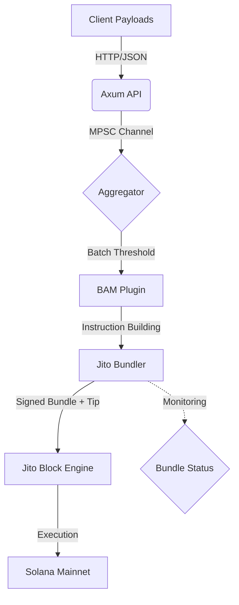

<p align="center">
  <h1>⚡ Jito BAM Plugin Template</h1>
  <p align="center">
    <strong>A high-fidelity framework for building Jito Block Assembly Marketplace (BAM) sidecars.</strong>
  </p>
</p>

<p align="center">
  
  
  
  
</p>

---

## 🏗️ Overview

This repository provides a production-ready, modular foundation for building **BAM Plugins**. By abstracting the complexity of the Jito Block Engine, MPSC aggregation, and transaction bundling, this template allows developers to focus entirely on their unique application logic.

### Why use this template?
- **Aggregator-Bundler Pattern**: Native support for batching high-frequency off-chain data.
- **ZK-Compression Ready**: Pre-integrated hooks for Light Protocol state resolution.
- **Jito Optimized**: Built-in tip management and bundle status monitoring.
- **Modular Core**: Swap payloads and logic by implementing a single trait.

---

## 🧬 Architecture

The following diagram illustrates the data flow from ingestion to on-chain execution via Jito:



---

## 🛠️ Components

- **`src/plugin.rs`**: The core `BamPlugin` trait. Define your payload type and instruction builder here.
- **`src/bundler.rs`**: High-performance integration with Jito's JSON-RPC SDK for bundling.
- **`src/zk.rs`**: Modular wrapper for ZK-Compression (Light Protocol) state proofs.
- **`src/main.rs`**: The async engine orchestrating the server, worker loops, and batching.

---

## 🚀 Getting Started

### 1. Prerequisites
- [Rust & Cargo](https://rustup.rs/) (v1.75+)
- A Solana Keypair for the BAM Authority.

### 2. Installation
```bash
git clone https://github.com/RYthaGOD/-jito-bam-template.git
cd -jito-bam-template
cp .env.example .env
```

### 3. Implement Your Logic
1. Open `src/example_impl.rs`.
2. Implement the `BamPlugin` trait for your custom payload.
3. Update `src/main.rs` to initialize your plugin instance.

### 4. Run the Sidecar
```bash
cargo run --release
```

---

## 🧪 Testing

The repository includes a simulation tool to verify your plugin's endpoint:

```bash
# Generate and send a mock payload
cargo run --bin generate_payload | curl -X POST -H "Content-Type: application/json" -d @- http://localhost:3030/submit
```

---

## 🛡️ Security & Privacy

This template is designed for **Trusted Execution Environments (TEEs)**. 
- **Signature Verification**: Ensure TEE signatures are verified in the `verify()` hook of your plugin.
- **MEV Protection**: Bundling ensures your transaction execution is atomic and protected from front-running.

## 🤝 Contributing

Contributions are welcome! Please open an issue or submit a PR if you have suggestions for improving the aggregation logic or adding more modular components.

## ⚖️ License

Distributed under the MIT License. See `LICENSE` for more information.
