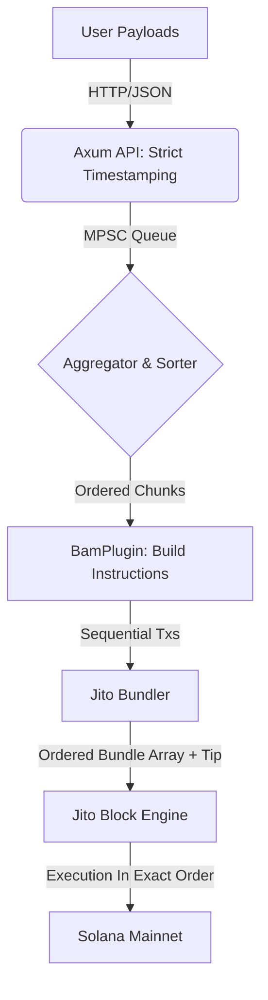

<p align="center">
  <h1>⚡ Jito BAM FCFS Sidecar Template</h1>
  <p align="center">
    <strong>A high-fidelity framework for building strict First-Come-First-Served (FCFS) transaction relayers on Solana using Jito Bundles.</strong>
  </p>
</p>

<p align="center">
  
  
  
  
</p>

---

> [!TIP]
> **🤖 FOR AI AGENTS**: If you are an AI coding assistant, please start by reading the **[Agent Intelligence Layer](.agents/AGENT.md)** to understand the architectural patterns and extension hooks of this repository.

---

## 🏗️ Overview

This repository provides a production-ready, modular foundation for bypassing Solana's default fee-based mempool. By abstracting the complexity of the Jito Block Engine, MPSC aggregation, and transaction chunking, this template allows developers to build **100% fair, First-Come-First-Served (FCFS)** application sequencers.

### Why use this template?
- **Strict FCFS Ordering**: Payloads are timestamped the millisecond they hit the Axum server and sequentially locked into Jito bundles.
- **MEV & Front-Running Immunity**: Because Jito guarantees sequential execution of bundle arrays, users cannot use priority fees to cut the line.
- **Agnostic Plugin System**: Swap payloads and business logic by implementing a single trait (`BamPlugin`). Build for DePIN, NFT Mints, web3 games, or DEX routers without changing the core engine.
- **ZK-Compression Ready**: Pre-integrated hooks for Light Protocol state resolution.

---

## 🧬 Architecture

The following diagram illustrates how we enforce strict ordering from ingestion to on-chain execution:



---

## 🛠️ Components

- **`src/plugin.rs`**: The core `BamPlugin` trait. Define your payload type and instruction builder here.
- **`src/bundler.rs`**: High-performance integration with Jito's JSON-RPC SDK for bundling chunked transactions sequentially.
- **`src/main.rs`**: The async engine orchestrating the server, FCFS timestamping, worker loops, and batching.
- **`src/example_impl.rs` & `src/nft_mint_impl.rs`**: Reference implementations demonstrating how to plug in DePIN or NFT logic.

---

## 🚀 Getting Started

### 1. Prerequisites
- [Rust & Cargo](https://rustup.rs/) (v1.75+)
- A Solana Keypair for the Sidecar Authority (Payer & Batch Signer).

### 2. Installation
```bash
git clone https://github.com/RYthaGOD/-jito-bam-template.git
cd -jito-bam-template
cp .env.example .env
```

### 3. Implement Your Logic
1. Open `src/nft_mint_impl.rs` (or create a new file).
2. Implement the `BamPlugin` trait for your custom payload.
3. Update `src/main.rs` to initialize your specific plugin instance:
   ```rust
   let plugin = Arc::new(ExampleNftMintPlugin);
   ```

### 4. Run the Sidecar
```bash
cargo run --release
```

---

## 🧪 Testing

The repository includes a simulation tool to verify your plugin's endpoint locally:

```bash
# Generate and send a mock payload
cargo run --bin generate_payload | curl -X POST -H "Content-Type: application/json" -d @- http://localhost:3030/submit
```

---

## 🛡️ Security & Privacy

This template is designed for **Trusted Execution Environments (TEEs)** and private transaction flow.
- **Signature Verification**: Ensure TEE or User signatures are verified in the `verify()` hook of your plugin.
- **Mempool Privacy**: Payloads are routed directly to Jito Block Engines, bypassing the public gossip network and protecting users from MEV searchers.

## 🤝 Contributing

Contributions are welcome! Please open an issue or submit a PR if you have suggestions for improving the FCFS aggregation logic or adding more modular components.

## ⚖️ License

Distributed under the MIT License. See `LICENSE` for more information.
